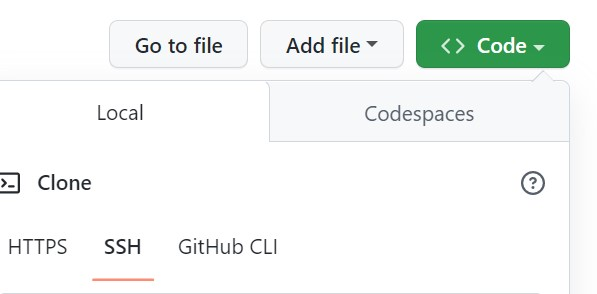
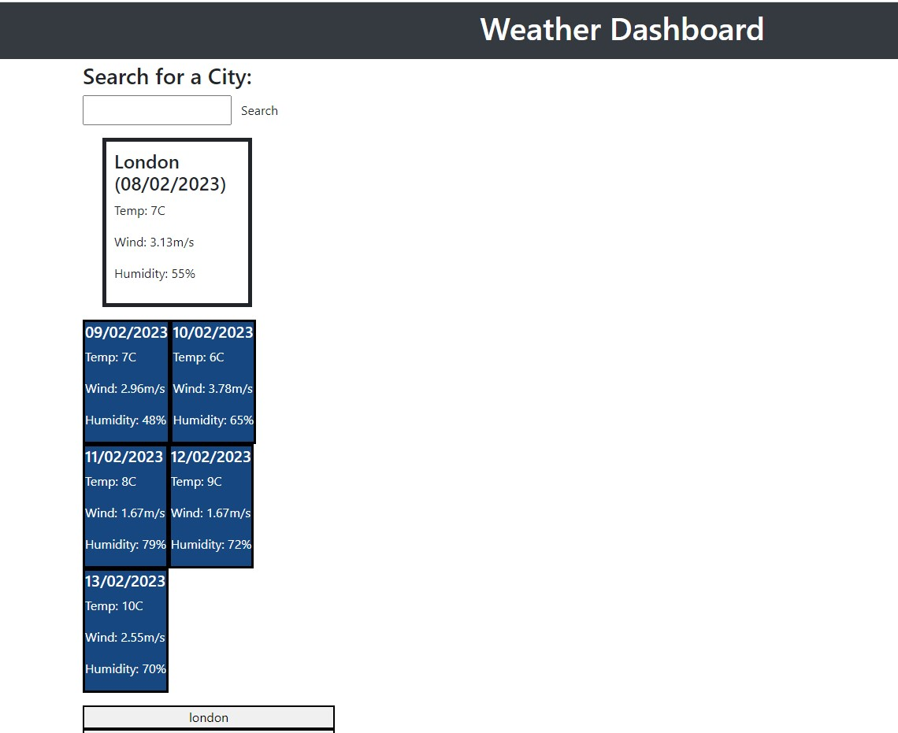

# Weather-Dashboard

## Project Description
This project is about office diplaying weather information for a searched city. It display the current weather and also a 5 day weather forcast.
For rescent searches which is persisted on page load for easy access.

## How it Works
On Page load, the landing page with an input form to search for a particular city.
successfull search returns current weather information and 5 days forcast is displayed.
Weather information displayed are: 
* Date displayed in 
* Temperature in celsius 
* Wind speed in m/s
* Humidity in percentage
Recent searches are saved in the localStorage and can easily access the weather information of the city by clicking on the search button.

## How to run project on local machine
* Install Visual Studio Code
* Navigate to main page of the git Repository
* Click on the 'Code'
* Copy the SSH line to run on the Terminal or  the HTTPS link
* Clone the repository - 

## links
## Deployed Url: [Weather dashboard](https://yemioyedeji89.github.io/Weather-Dashboard/).

## Web Page Screenshots

## Future developments
* styling the web page
* Adding Weather icons

## Contribute
If you want to learn more about git clone. you can seek inspiration from the below:
#### External files
[Github Docs](https://docs.github.com/en/repositories)

[W3schools](https://www.w3schools.com/js/default.asp)

